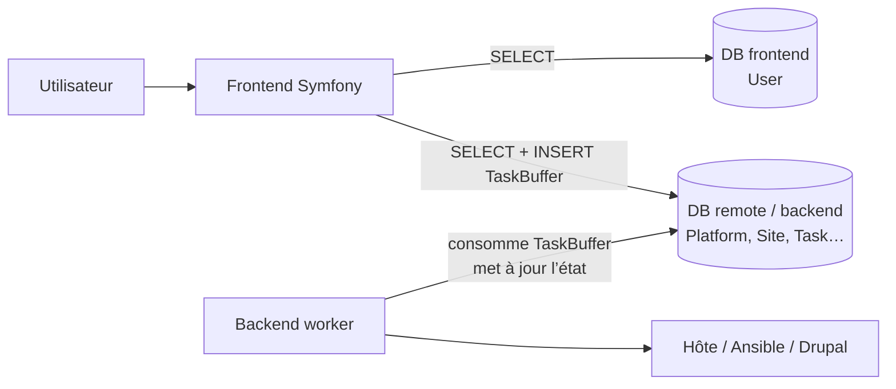
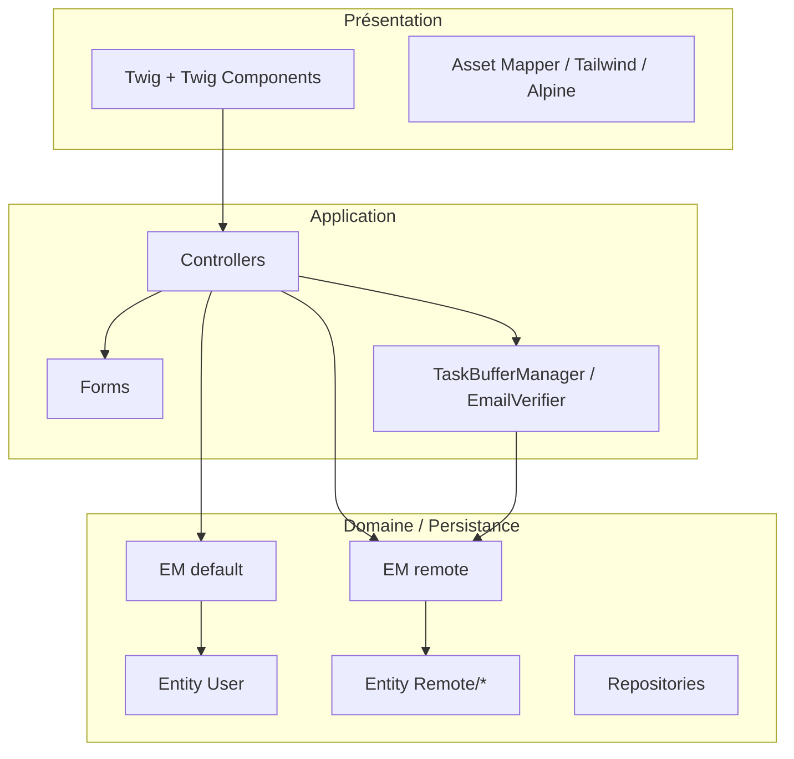
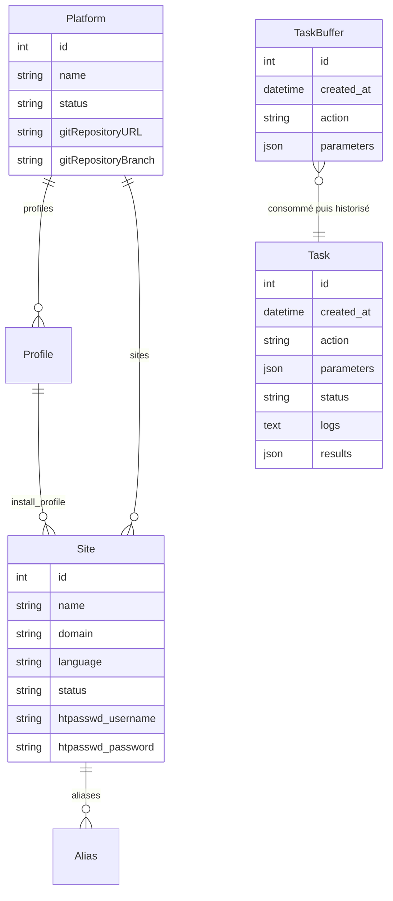
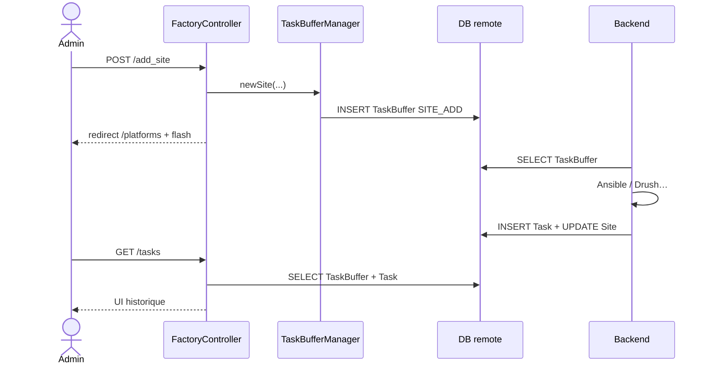

# Document d'Architecture Technique — Frontend DropFactory

| Métadonnée | Valeur |
|---|---|
| Composant | Frontend Symfony (`frontend/`) |
| Projet | DropFactory |
| Version cible | Symfony 6.4 LTS |
| Date | 2026-09-04 |
| Statut | Vivant (à maintenir avec le code) |

---

## 1. Objet du document

Ce DAT décrit l’architecture technique de l’interface web DropFactory : console d’administration permettant de gérer des plateformes Drupal et les sites associés, sans exposer la complexité d’exécution au navigateur.

Il couvre :

- le positionnement du frontend dans le système DropFactory ;
- la stack et l’organisation du code ;
- le double modèle de données (auth vs usine) ;
- le contrat asynchrone avec le backend via `TaskBuffer` ;
- la sécurité, l’UI et le déploiement.

---

## 2. Contexte et positionnement

DropFactory est composé de deux blocs principaux :

| Bloc | Rôle |
|---|---|
| **Frontend** (ce document) | Interface utilisateur Symfony : authentification, consultation, formulaires, création de tâches |
| **Backend** (`backend/`) | Worker / Ansible : consomme les tâches, provisionne plateformes et sites Drupal |

Le frontend **ne provisionne pas** les sites. Il lit l’état métier dans la base « remote » (backend) et **écrit uniquement** des demandes dans la table `TaskBuffer`. Le backend traite ces demandes et met à jour `Task`, `Platform`, `Site`, etc.



---

## 3. Objectifs techniques

1. Fournir une UI low-code pour gérer plateformes, sites, tâches et utilisateurs.
2. Isoler les comptes applicatifs (Symfony) de l’état d’usine (backend).
3. Découpler l’action utilisateur de l’exécution longue via une file `TaskBuffer`.
4. Respecter un modèle de rôles simple (`ROLE_USER` / `ROLE_ADMIN`).
5. S’appuyer sur une UI composable (Twig Components, Atomic Design) et des assets modernes (Asset Mapper, Tailwind, Alpine.js).

---

## 4. Stack technique

| Couche | Technologie |
|---|---|
| Runtime | PHP ≥ 8.1 (dev local Lando : PHP 8.3) |
| Framework | Symfony 6.4.* |
| ORM | Doctrine ORM 3 / DBAL 3 |
| Templates | Twig + `symfony/ux-twig-component` |
| Formulaires / validation | Symfony Form + Validator |
| Sécurité | Security Bundle (form login, CSRF) |
| E-mail | Mailer + `symfonycasts/verify-email-bundle` |
| CSS | Tailwind CSS via `symfonycasts/tailwind-bundle` |
| JS | Asset Mapper + Importmap (Alpine.js 3, Choices.js) |
| Serveur web (prod) | Nginx + PHP-FPM |
| Dev local | Lando (`frontend/.lando.yml`) |

Dépendances principales : voir `composer.json`.

---

## 5. Structure du dépôt `frontend/`

```
frontend/
├── assets/                 # JS / CSS sources (Asset Mapper)
├── bin/console
├── config/
│   ├── packages/           # doctrine, security, twig, mailer…
│   ├── routes/
│   └── services.yaml
├── migrations/             # EM default (User)
├── migrationsRemote/       # schéma remote (référence / historique)
├── public/                 # document root
├── src/
│   ├── Controller/
│   ├── Entity/             # User (default)
│   ├── Entity/Remote/      # Platform, Site, Task…
│   ├── Form/
│   ├── Repository/
│   ├── Security/
│   ├── Service/            # TaskBufferManager
│   └── Twig/Components/    # PHP des composants UX
├── templates/
│   ├── components/         # Atoms / Molecules / Regions / Utils
│   ├── factory/, admin/, security/, registration/…
│   └── base.html.twig
├── localBuild.sh / serverBuild.sh
├── importmap.php
├── tailwind.config.js
└── DAT.md                  # ce document
```

---

## 6. Architecture applicative

### 6.1 Couches



Pattern dominant : **contrôleurs fins + service métier unique** (`TaskBufferManager`) pour toute écriture asynchrone vers le backend. Pas d’API REST publique : navigation HTML classique (PRG / redirects + flash messages).

### 6.2 Injection de dépendances

- Autowire / autoconfigure via `config/services.yaml`.
- Accès multi-EM via `Doctrine\Persistence\ManagerRegistry` (`getManager('remote')`).
- Attributs PHP : `#[Route]`, `#[IsGranted]`.

---

## 7. Double base de données

### 7.1 Connexions et entity managers

Configurée dans `config/packages/doctrine.yaml` :

| Connexion / EM | Variable d’env | Contenu | Droits attendus (prod) |
|---|---|---|---|
| `default` | `DATABASE_URL` | Comptes Symfony (`User`) | ALL sur DB frontend |
| `remote` | `REMOTE_DATABASE_URL` | État usine + file de tâches | SELECT sur DB backend ; **INSERT** sur `TaskBuffer` |

En production, le frontend et le backend partagent la base « backend » avec des grants distincts (voir README racine).

### 7.2 Migrations

| Dossier | Entity Manager | Usage |
|---|---|---|
| `migrations/` | `default` | Gérées par `doctrine:migrations:migrate` |
| `migrationsRemote/` | `remote` | Présentes pour historiser le schéma remote ; config dédiée commentée (`doctrine_migrations_remote.yaml`) — le schéma remote est en pratique porté / consommé avec le backend |

### 7.3 Modèle de données

#### Base frontend — `User`

| Champ | Description |
|---|---|
| `email` | Identifiant unique (login) |
| `roles` | JSON (`ROLE_USER`, `ROLE_ADMIN`) |
| `password` | Hash Symfony (`auto`) |
| `isVerified` | Confirmation e-mail |

#### Base remote — relations métier



Statuts plateforme / site : `ENABLED`, `DISABLED` (+ `DELETED` pour site).

---

## 8. Contrat asynchrone : file de tâches

### 8.1 Principe

1. L’utilisateur déclenche une action (formulaire ou lien `/new_task/...`).
2. `TaskBufferManager` crée une ligne `TaskBuffer` (`action` + `parameters` + `created_at`).
3. Le backend poll / consomme `TaskBuffer`, exécute, écrit une `Task` (historique : statut, logs, résultats) et met à jour les entités métier.
4. Le frontend affiche `TaskBuffer` (en attente) + `Task` (historique) sur `/tasks`.

### 8.2 Service `TaskBufferManager`

| Méthode | Action buffer | Paramètres typiques |
|---|---|---|
| `newPlatform()` | `PLATFORM_ADD` | name, gitUrl, gitBranch |
| `newSite()` | `SITE_ADD` | platformId, name, domain, installProfileId, language, aliases, htpasswd* |
| `editSite()` | `SITE_EDIT` | resourceId, name, aliases, htpasswd* |
| `newTask()` | action libre whitelistée | resourceId |

Fuseau horaire d’écriture : `Europe/Paris`.

### 8.3 Catalogue d’actions (`Task::ACTIONS`)

**Plateforme :** `PLATFORM_ADD`, `PLATFORM_VERIFY`, `PLATFORM_PULL`, `PLATFORM_DISABLE`, `PLATFORM_ENABLE`

**Site :** `SITE_ADD`, `SITE_VERIFY`, `SITE_CLEAR_CACHE`, `SITE_RUN_CRON`, `SITE_DB_UPDATES`, `SITE_BACKUP`, `SITE_CLONE`, `SITE_RESET_PASSWORD`, `SITE_DISABLE`, `SITE_ENABLE`, `SITE_EDIT`, `SITE_DELETE`

**Statuts d’exécution :** `PENDING`, `RUNNING`, `SUCCESS`, `WARNING`, `FAILED`

### 8.4 Flux nominaux



---

## 9. Contrôleurs et routes

Routage par attributs (`config/routes.yaml` → `src/Controller/`).

| Contrôleur | Préfixe / routes principales | Accès |
|---|---|---|
| `BluedropController` | `/`, `/legal-notices` | Public |
| `SecurityController` | `/login`, `/logout` | Public / session |
| `RegistrationController` | `/register`, `/verify/email` | Admin pour register ; auth pour verify |
| `UserController` | `/profile` | `ROLE_USER` |
| `FactoryController` | `/platforms`, `/sites`, `/tasks`, `/backups`, CRUD sites/plateformes, `/new_task/...` | Classe : `ROLE_USER` ; certaines actions restreintes admin |
| `AdminController` | `/admin`, `/admin/users`, édition/suppression users, `/clear-cache` | `ROLE_ADMIN` |
| `TestController` | `/test-icons`, `/test-flash` | Dev / QA UI |

### 9.1 Factory — responsabilités

- Listes plateformes / sites (données tabularisées pour le composant `Atoms:Table`).
- Détail plateforme / site + liste de tâches disponibles selon statut et rôle.
- Création plateforme / site, édition site (aliases, htpasswd).
- File d’attente + historique des tâches.
- Tâches unitaires (`/new_task/{taskName}/{resourceId}`) et groupées (`/add_group_task/{taskName}/{ids}`).

Restriction runtime (non-admin) : certaines actions site/plateforme sont refusées même si la route est accessible (`PLATFORM_*`, `SITE_VERIFY`, `SITE_DB_UPDATES`, `SITE_BACKUP`, `SITE_RESET_PASSWORD`, …).

---

## 10. Sécurité

### 10.1 Authentification

- Provider Doctrine : `App\Entity\User` sur propriété `email`.
- Firewall `main` : `form_login` (`app_login`) + logout (`app_logout` → homepage).
- CSRF activé sur le login.

### 10.2 Autorisation

```yaml
role_hierarchy:
  ROLE_ADMIN: ROLE_USER

access_control:
  - { path: ^/admin, roles: ROLE_ADMIN }
  - { path: ^/register, roles: ROLE_ADMIN }
  - { path: ^/add_platform, roles: ROLE_ADMIN }
  - { path: ^/profile, roles: ROLE_USER }
```

Compléments dans le code :

- `FactoryController` : `#[IsGranted('ROLE_USER')]`
- `AdminController` : `#[IsGranted('ROLE_ADMIN')]`
- Contrôles fins sur les tâches et CSRF sur suppression utilisateur.

### 10.3 Cycle de vie utilisateur

1. Un admin crée un compte via `/register` (choix de rôle).
2. E-mail de confirmation signé (`EmailVerifier` + VerifyEmail bundle).
3. L’utilisateur se connecte ; vérification e-mail via `/verify/email` (session requise).
4. Admin peut éditer rôles / mot de passe et supprimer un compte (sauf le sien).

---

## 11. Couche présentation

### 11.1 Design system — Twig Components

Organisation Atomic Design sous `templates/components/` + classes PHP miroir dans `src/Twig/Components/` :

| Niveau | Exemples |
|---|---|
| **Atoms** | Button, Link, Icon, Table, Status, FormElement, Alert, Badge, Select… |
| **Molecules** | Card, Modal, Dropdown, Menu, Hero, FormContainer, LaunchTask, Hamburger |
| **Regions** | Header, Footer |
| **Utils** | Grid, Section |

Config : `twig_component.yaml` — namespace `App\Twig\Components\` → templates `components/`.

### 11.2 Assets

| Élément | Rôle |
|---|---|
| `assets/app.js` | Entrypoint : CSS, Alpine, Choices, tags d’aliases |
| `assets/styles/app.css` | Styles applicatifs |
| `importmap.php` | Alpine.js, Choices.js |
| `tailwind.config.js` | Tokens marque (bleu Bluedrop), typo Plus Jakarta Sans, breakpoints |

Build :

- Local : `localBuild.sh` (via Lando) — importmap, tailwind, asset-map, cache.
- Serveur : `serverBuild.sh` — idem avec Tailwind minifié.

### 11.3 Formulaires

| Type | Usage |
|---|---|
| `PlatformType` | Ajout plateforme |
| `SiteType` / `SiteEditType` | Création / édition site (+ collection `AliasType`) |
| `RegistrationFormType` / `UserEditType` | Comptes |

Thème Twig custom : `templates/form/theme.html.twig`.

---

## 12. Configuration et environnements

### 12.1 Variables d’environnement

| Variable | Rôle |
|---|---|
| `APP_ENV` / `APP_SECRET` | Environnement Symfony / secret |
| `DATABASE_URL` | EM default |
| `REMOTE_DATABASE_URL` | EM remote |
| `MAILER_DSN` | Transport e-mail (`null://null` en local sans envoi) |

- Dev Lando : credentials dans `.env` (non commité pour secrets serveur).
- Prod : surcharges dans `.env.local`.

### 12.2 Lando (dev)

Services : MySQL `database` + `remote_database`, PHPMyAdmin, Node 20. Recipe Symfony, webroot `public`.

### 12.3 Production (rappel)

- Document root : `frontend/public`.
- Nginx + PHP-FPM 8.4 (cf. README racine).
- Après déploiement : `composer install`, migrations default, `serverBuild.sh` (ou équivalent).

---

## 13. Journalisation et observabilité

- Monolog Bundle configuré (`config/packages/monolog.yaml`).
- Web Profiler disponible en environnement `dev`.
- Visibilité métier des exécutions : logs / résultats stockés sur l’entité `Task` et affichés dans l’UI `/tasks`.

---

## 14. Références

| Document / chemin | Contenu |
|---|---|
| `/README.md` | Installation globale DropFactory |
| `frontend/README.md` | Prérequis DB duales |
| `frontend/composer.json` | Dépendances PHP |
| `frontend/config/packages/doctrine.yaml` | Dual EM |
| `frontend/config/packages/security.yaml` | AuthZ / AuthN |
| `frontend/src/Service/TaskBufferManager.php` | Contrat d’écriture asynchrone |
| `frontend/src/Entity/Remote/Task.php` | Catalogue d’actions |
